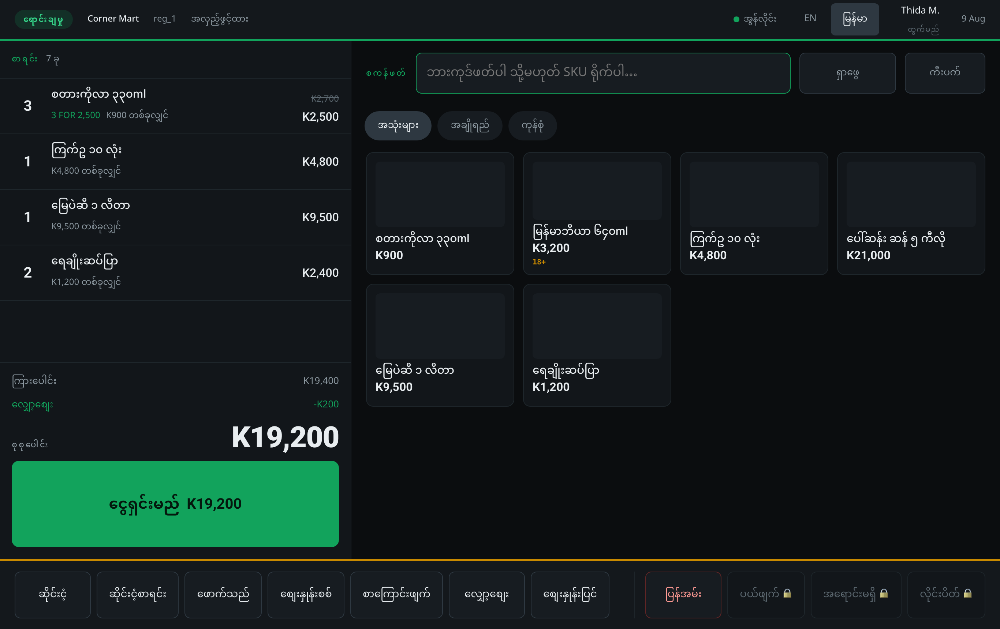

# Kite POS

A point of sale for a single corner shop, built to run on Cloudflare's free
tier. One Hono Worker over D1 and R2, and **two installable PWAs written in
[Kite](https://kite-lang.dev)** — a till for the counter and a back office for
whoever owns the place.

```bash
npm install
npm run setup            # create the local D1 and apply the migrations
npm run dev              # the Worker on :8787 and the apps on :5173
```

Then open <http://localhost:5173/office.html>, create the first owner (below),
and <http://localhost:5173/> for the till.

---

## Two apps, and why

**A role decides which app a sign-in opens, and there is no navigation between
them.** That is the load-bearing decision in this project and everything else
follows from it.

| | | |
|---|---|---|
| **Till** — `index.html` | Sale staff | A 4-digit PIN at the lane. Full screen: ledger, work area, command bar, status bar. No rail, no reports, no settings, no way out except signing off — which is the operator's own name in the status bar, and is refused while the basket has lines on it. |
| **Back office** — `office.html` | Manager, owner | Username and password. Everything the shop is made of — stock, buying, books, staff — and **Tills** for the lanes. |

A manager reaches a till by walking to it and authorising there, or by taking a
lane over from Tills. The register is not in the back office's navigation, and
a cashier's session is refused by the Worker on every back-office route — the
separation is enforced at the API, not by hiding links.

They are separate HTML entries with separate manifests, so a counter tablet
installs the till and never carries the office's icon. They share every module
in `app/src/`, because a Kite module is a directory: `api.kite`, `money.kite`
and `i18n.kite` are compiled into both without a line of either duplicated.

## What it does

Modelled on the feature set of `corner-mart-pos`, **without the AI assistant**.



The four regions, in the language the lane is set to: the **ledger** on the
left with the 3-for-2,500 offer pricing the colas and the shelf price struck
through, the **work area** with the scan box and the tile grid, the **commands**
across the bottom with the manager-only ones shown locked rather than hidden,
and the **status** bar carrying lane health and nothing else. Product names come
from `name_my` where the catalogue has one and fall back to the stored name
where it does not; amounts, quantities and SKUs stay in Latin digits. The tile
pictures are placeholders — a shopkeeper takes their own, from the product form.

**At the till** — a scan box that never loses focus, a quick-key grid and
category tabs, search, a merged basket (a rescan makes "×3", not three rows),
offers shown on the line with the shelf price struck through, age checks that
give the operator the date to check against, held baskets that survive a
refresh because they are database rows, split tender across cash / card /
wallet / store credit, price checks, and EN ⇄ မြန်မာ.

The full command bar is live, gated exactly as the matrix says: **Hold**,
**Held**, **Customer** (search, attach, or sign somebody up at the counter),
**Price check**, **Void line**, **Discount** and **Price override** (a
manager's PIN at the lane), **Return** (pick the receipt, count the units back
with a stepper, manager's PIN), **Void sale**, **No sale** (manager only, and
logged to the shift) and **Close lane** (a counted close that signs the lane
out).

**In the back office**, fourteen screens off one rail:

| | |
|---|---|
| Overview | the day at a glance — takings, margin, stock, top sellers, lanes |
| Tills | every lane as a card: who is on it, what the drawer should hold, what it is ringing, and the authorisations taken at it today |
| Sales | seven days of receipts, with what came back |
| Shifts | every drawer session and its over/short |
| Products | the catalogue, flagged low and out, each with a picture taken at the counter or chosen from the device |
| Inventory | valuation at cost and retail, what needs attention, and value by category |
| Purchasing | the reorder worksheet from what actually sold, purchase orders, and payables aged into buckets by supplier — with an invoice raised in error cancellable rather than payable |
| Customers | visits, spend, points and store credit |
| Promotions | every offer, whether it is live, and what each one gave away |
| Reports | the trading day by hour, products and categories by margin, tenders, by cashier, tax collected by rate, dead stock, and stock valuation — ten of them, all exportable |
| Accounting | eight sheets — summary with a ledger-health sweep, profit and loss, balance sheet, trial balance, general ledger, journal, chart of accounts, periods — over a window you pick, each saving as CSV |
| Expenses | what was spent, against which account, and the tax paid on it |
| Staff & access | the two roles, and the command matrix the till's command bar is built from |
| Settings | everything the shop can configure, and closing a month |

Plus four drill-downs reached by touching a row, each with its own address so a
manager can send somebody a link: **a product** (margin, barcodes, thirty days
of sales, every stock movement), **a receipt** (printable, with the per-line
offer snapshots, and a refund), **a shift** (the expected figure derived term by
term, cash in and out, tenders, sales) and **a purchase order** (receive a line
or the lot).

The whole of `corner-mart-pos` except its AI assistant, which was excluded
deliberately.

## How the money works

Every amount is an **integer count of the currency's minor unit** and a float
never touches a price, a total, or a tax figure. The unit comes from one
setting: `currency.minor_units` is `0` for MMK, where the integer *is* the
amount, and `2` for a currency with cents. Nothing else changes.

- **Parsing reads digits, not `parseFloat`.** `"1.005"` is really
  `1.00499999999999989` as a double and would round *down*; read as digits it
  correctly becomes `1.01`. Anything that is not an amount is refused rather
  than read as zero, so a typo can never quietly become a free item.
- **Tax is integer arithmetic.** A rate is basis points, and extracting tax from
  a tax-inclusive price is `gross × bp / (10000 + bp)` — computed exactly and
  rounded once at the end.
- **Quantity is the one legitimate float**, because 0.35 kg of loose goods is a
  measurement. The product of a quantity and a price comes back to a whole
  minor unit at that single boundary.
- **A basket discount is spread by line value** and the parts sum to exactly the
  whole — the remainder goes to the largest line, where it is proportionally
  smallest. There is a test.
- **`priceSale` in `api/src/lib/sales.ts` is the only writer of any derived
  amount.** One place for the arithmetic to be wrong and one place to look when
  a receipt does not add up.

### The books

Four properties, three of them enforced by the database rather than by hope:

- **No balance is stored.** Every figure in every report is summed from
  `journal_lines`.
- **Postings are immutable by construction** — triggers refuse `UPDATE` and
  `DELETE` whatever the application tries.
- **An entry must balance and must touch two accounts** to be written.
- **Value time and booking time are separate**, and a closed month refuses
  anything posted into it, including a backdated correction.

Accounting is off until `accounting.enabled` is set; a shop that does not want a
ledger should not be made to carry one. Switching it on in a shop that has been
trading posts an opening balance — what is on the shelves at cost, plus the
cash, against owner capital — because a ledger that says the shop owns nothing
on the day it starts is wrong in one direction forever.

**Eight sheets, one window.** Summary, profit and loss, balance sheet, trial
balance, general ledger, journal, chart of accounts, and periods; today, seven
days, thirty days, this month or all time. The window is state rather than a
literal, and it carries across the sheets — moving from a profit and loss to a
trial balance must not silently change the period underneath it.

Each sheet drills into the next. A row of the trial balance, the profit and
loss or the balance sheet opens that account's **general ledger** — every
movement with an opening balance above it and a running balance beside it,
because a trial balance with no way to ask where a figure came from raises the
one question it cannot answer. The **journal** shows each entry with the lines
that make it up, filterable by what caused it, by account, or by text.

**Nothing can be edited or deleted**, so the correction path is a reversal: an
equal and opposite entry, dated today, linked to the original by `corrects_id`.
Both stay in the journal. That is the difference between an audit trail and a
redaction — and it is what the immutability triggers' own message ("post a
correction") has always told you to do.

**The books re-check themselves** every time the page opens: debits against
credits, every entry individually, lines with no entry, the accounting
equation, and `products.stock` against the sum of its own movements. Structure
stops most mistakes and the posting rules stop the rest, but neither catches a
bug that already shipped.

The stock valuation note underneath is deliberately *not* a failure. The
shelves are valued at what each product costs **today**; account 1200 carries
what that stock cost **when it was bought**. A supplier raising their price
revalues the shelf and must not rewrite history, so the two are shown side by
side with the reason rather than raised as an alarm.

### Exports

Every accounting sheet and all ten operational reports save as CSV, over
whatever window is on screen.

The decisions in `api/src/lib/csv.ts` are all about the one place in this system
where the reader is not us — a shopkeeper handing a file to an accountant who
opens it in Excel on Windows:

- **Amounts carry no symbol and no thousands separators.** `K1,234` is a column
  of *text*, and a column of text does not add up, so the total the accountant
  needs is the one thing they cannot get.
- **Dates are ISO 8601.** `9 Aug 2026` sorts April first.
- **Every file opens with a byte-order mark.** Excel reads a UTF-8 file without
  one in the system code page, which turns every Burmese character into
  mojibake. This shop ships Burmese.
- **An unknown sheet is refused rather than substituted.** Falling back to a
  default hands somebody a trial balance in a file named `profit-and-loss.csv`,
  which is worse than an error: they would file it.

## Concurrency, without transactions

D1 has no interactive transaction, so nothing here reads a row, decides, and
then writes assuming the answer held. Every operation that must happen once is a
**conditional write**:

- Completing a sale requires it to still be `held`, so a double-tapped Pay and a
  replayed request both land on the same sale.
- Refunding a line requires the units to still be unrefunded, checked in the
  same statement that writes them.
- Paying a supplier invoice requires a balance still outstanding.
- One open shift per lane, and one active basket per lane, are partial unique
  indexes rather than checks.
- Sale numbers come from `UPDATE … RETURNING`, so two tills get two numbers.

`sales.client_id` is a unique idempotency key, minted once per **basket** and
**read before anything else runs** — `POST /till/pay` answers a repeated key with
the sale it already made. Both halves are load-bearing: a key minted per attempt
is a different key on every retry, and a key that is written but never read
cannot collapse anything.

**The claim goes in its own round trip, and its result is checked before
anything that depends on it is written.** This is the rule to keep, and it is
the one that was got wrong in six places: a statement matching no rows is a
*success* in SQLite, so it cannot abort a `batch()`. Putting the consequences in
the same batch as the claim meant a refused payment still moved the books, a
refused drawer close posted a second variance and sweep, a refused stock count
still wrote the write-off, and a retried Pay rang the stock and the ledger twice
— each of them raising a 409 over the top of work that had already committed.
See `docs/audit.md`, and `api/src/lib/refunds.ts` for the shape at its fullest:
claim, read back what landed, then derive everything else from that.

## The design

Implemented from the four design documents in the Claude Design project
*"POS and Backoffice separation"*. The till is **four fixed regions in one order
of authority** — ledger, work area, commands, status — which never reorder
between viewports; they resize, demote to icons, or become a tab.

Touch sizes are in millimetres at a stated density, because the published minima
are physical: **20 mm** keypad and commit keys (Colle & Hiszem 2004, where 25 mm
tested no better), 15 mm tiles, 12 mm rows, nothing interactive below 9.5 mm,
and 8 px gaps because spacing had no measurable effect in that study — so the
screen budget goes into target size.

**What is never traded away**, at any size: the running total is visible in
every viewport and mode; the commit button is pinned and never scrolls; the scan
field never loses focus; a restricted command is shown **locked, never hidden**
— it is how a cashier learns to call a manager; and the connection state is
always on screen, because this till is online and that dot is load-bearing.

`app/src/style.css` ends with the degradation ladder written as a rule rather
than a set of breakpoint hacks.

### Languages

EN and မြန်မာ, as a **lane setting** in the status bar — visible everywhere,
never inside a menu, and deliberately small at 44 px because switching language
mid-basket is a mistake rather than a workflow.

Money, quantities, SKUs and dates stay in Latin digits. Product names come from
one database field and are shown as stored: **chrome switches, the catalogue does
not.** Burmese gets a taller line box from one `lang` attribute on the document.

The back office has the same switch, in its page header, kept under its own
key: a manager reading မြန်မာ at the desk should not silently switch every lane
in the building. It seeds from the shop's `locale.default` until somebody at
that desk chooses for themselves.

**The two vocabularies are separate files, and that is a size decision rather
than a filing one.** Both programs compile from one `src/` directory, and
everything reachable from a program's imports lands in its WebAssembly — so
`i18n.kite` holds the till's 75 phrases and `words.kite` holds the back
office's 1,300. Putting them together took the till from 184 KB to 529 KB: a
lane device paying, on every cold start, for a chart-of-accounts vocabulary it
will never show. `pos.kite` reaches neither `desk.kite` nor `words.kite`, so
none of the back office's ~780 translated phrases are on the lane.

The Burmese is the reviewed set from the Corner Mart build rather than a fresh
translation — the same shop, the same tills, the same accounting vocabulary a
native speaker has already been through. What had to be added on top was
composed from words already in that set and is marked as such, group by group,
so reviewed and unreviewed can still be told apart.

A missing phrase falls back to English, then to the key itself. A screen
reading `products.shelf_price` where nothing is defined shows
"products.shelf_price" — ugly, findable, and obviously wrong, which is what you
want from a gap. An empty string is a blank column nobody notices.

> **Have a native speaker approve the command vocabulary before the shop
> opens** — a cashier misreading ပယ်ဖျက် (void) for ပြန်အမ်း (return) is a
> cash-drawer problem, not a copy problem.

## Layout

```
api/                      the Worker
  migrations/             D1 schema — read 0001_init.sql first
  src/lib/                money, pricing, sales, ledger, auth, crypto, commands
  src/routes/             one file per area of the shop
  test/money.test.ts      the arithmetic, in isolation
  test/smoke.mjs          the money path end to end, against `wrangler dev`
app/                      both front ends
  index.html              the till          → src/pos.kite
  office.html             the back office   → src/office.kite
  src/*.kite              one Kite module; every file is a sibling of the others
  test/run-kite.mjs       runs a Kite program that has siblings
```

Read `app/src/` top to bottom: `pos.kite` and `office.kite` are the wiring,
`till.kite` and `office_view.kite` are pure functions from a store to
`html.Node`, `store.kite` and `desk.kite` are the values, and `doc.kite` and
`browser.kite` are the only files that know a host exists.

**There are no event handlers in the described elements.** `html.Node` has
nowhere to put one, so a `data-action` attribute names what an element means and
one listener on the root reads it off whatever was touched. A rebuilt
description has nothing to reattach.

## Deploying

```bash
# once
npx wrangler d1 create kite-pos                 # put the id in api/wrangler.toml
npx wrangler r2 bucket create kite-pos-photos
npm run deploy:api --workspace=@kite-pos/api    # note the Worker's URL

# point the apps at the Worker: set <meta name="api-base"> in index.html and
# office.html, and ALLOWED_ORIGINS in api/wrangler.toml to the Pages URLs
npm run db:migrate --workspace=@kite-pos/api
npm run deploy:app
```

The apps are static files, so Pages serves them and the `api-base` meta tag is
the only thing that differs between a test shop and a real one — there is no
build-time configuration to get wrong.

### First run

No credentials are seeded. A migration cannot compute a PBKDF2 hash, and a
default password that works is one nobody changes — so the first owner is
created once, and the endpoint refuses forever after:

```bash
curl -X POST https://YOUR-WORKER/api/setup \
  -H 'content-type: application/json' \
  -d '{"name":"Owner","username":"owner","password":"something long"}'
```

Then sign in to the back office and add staff. Sale staff get a PIN; it has to
be unique among active staff, because the lane asks for four digits and nothing
else and "who rang this sale" has to have an answer.

## Tests

```bash
npm test                 # arithmetic, in TypeScript and in Kite
npm run test:smoke       # the money path end to end (needs `npm run dev:api`)
npm run check            # both Kite programs compile, and their wasm validates
```

The Worker is typechecked by **TypeScript 7**, which is the native compiler —
`tsc` is a shim that hands off to a Go binary, picked per platform from
`optionalDependencies` and pinned in the lockfile for all twenty of them. It
checks this codebase in **0.43 s against 5.7's 1.12 s**, on the same files with
the same `tsconfig.json`; nothing in the config had to change.

`test/smoke.mjs` sets a shop up, puts a cashier on a lane, rings a basket with
an offer and an age-restricted line, refuses a short payment and a card charged
more than the total, takes a split payment, and refunds a line twice to check
the second is refused. Then it re-checks every bug the two audits found, saves
all sixteen exports and reads their headers back, and confirms the ledger
balances and the sheet does too.

**It turns the books on itself**, so the accounting half runs on any shop
rather than only on one where somebody had already enabled it by hand — which
is what it was doing, and which meant a clone of this repo tested none of it.

**It is idempotent.** Running it three times against the same shop must pass
three times — which is how the duplicate categories and customers were found,
and why a suite that needs a fresh database is a suite that will pass while the
shop's data says otherwise.

## Known gaps

Stated rather than implied:

- **Ringing sales while offline is not built.** The service worker caches the
  app shell so a till with no connection still *starts*, and API requests are
  deliberately never cached — a stale price is a wrong charge. The server side
  of a real outbox exists (`sales.client_id` is a unique idempotency key); the
  client basket and replay are not written.
- **Customer, Return, No sale and Close lane** appear in the till's command bar
  because the design says a command is never hidden, and they say plainly that
  they are not built yet rather than doing nothing.
- **Nothing is stubbed.** Every screen reads and every screen writes: products,
  categories, suppliers, barcodes, offers, customers, staff (add, PIN,
  password, deactivate), stock adjustments, purchase orders (raised from the
  worksheet, sent, received line by line or all at once), supplier invoices and
  payments, expenses, drawers (open, cash in and out, counted close), refunds,
  lanes, settings and month-end close.
- **`docs/audit.md`** records eighteen correctness bugs two adversarial reviews
  found *after* the end-to-end checks were all passing — a fractional price
  reaching the immutable journal, refunds that summed to more than the line was
  charged, store credit that was never drawn down, an accounting window applied
  in a `LEFT JOIN … ON` clause so every report was lifetime, a manager-only
  guard that was dead code, and four places where a ledger posting was batched
  with the conditional write it depended on and committed after the refusal.
  A second pass, against a stated fintech discipline, then found seven more —
  including a split return that never reversed the tax it collected, a
  back-office refund charged to the drawer session the *sale* was rung on, and
  an idempotency key that was written and never read. All fixed, each with a
  regression check. Worth reading before extending this: the same mistakes are
  the ones easiest to make again.
- **A dispatch table is a `match`; a condition stays an `if`.** A sweep over
  every Kite file found 65 chains and 203 branches, and forty of them were
  conditions wearing a chain's shape — nil checks, length tests, `starts_with`
  predicates. Two of the large ones survive as `if` deliberately: `pressed()`
  and `clicked()` each have arms that do not return, and converting them drops
  a command silently. Two rules the compiler taught rather than the spec: a
  bare `return` is a statement, so an arm that leaves the function must be a
  block; and an arm ending in a call to an `async fn` yields that call's
  `Task<()>`, which will not unify with a sibling arm's `()` — keeping the
  arm's `return` is what makes it diverge instead.

- **`npm run check` validates the emitted WebAssembly**, not just the types.
  `kitec` checking clean is not the same as a module the engine will load — this
  build hit a codegen bug where it wasn't, and nothing caught it until the page
  was open. Fixed upstream in Kite 0.1.5; the validation stays, because it costs
  a millisecond and the failure mode is a blank screen with no error.
- **The chart of accounts is seeded, not editable.** Corner Mart lets an
  account be added, renamed and deactivated; here the sixteen seeded accounts
  plus the seven operating ones are what a corner shop needs, and a migration
  adds more. The screen lists them and drills into each one's ledger, which is
  what the chart is read for.
- **Two tablet items are CSS-complete but structurally deferred.** The command
  strip still spans the full width rather than the work column in landscape,
  and the tender screen keeps its summary in the work area rather than moving
  the tender rows into the ledger. Both are `page()`/`work_tender()` changes in
  `till.kite` that would invalidate the four-viewport verification behind the
  rest of the tablet work, so they are written down rather than half-done. The
  stacking rule at `max-width: 1331px` in `style.css` exists only because of
  the second one, and its comment says so.
- **Phone landscape (844 × 390) is not a supported viewport.** Horizontal
  overflow there is down to zero, but the status bar renders as a floating stub
  because `#app { flex-direction: row }` leaves it a `flex: none` sibling. The
  four tablet viewports and phone portrait are the ones that were verified.

- **The currency defaults to MMK** with zero minor units, from the design
  documents. `currency.minor_units` changes it, but only before there is
  trading — it reinterprets every integer already stored, so it is a migration
  rather than a setting to flip.
